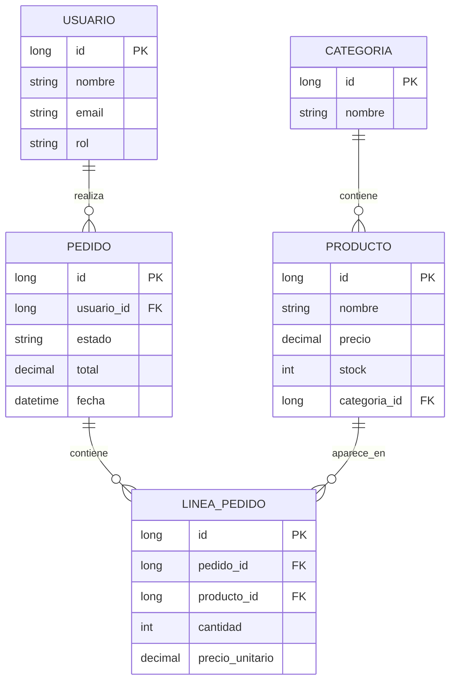
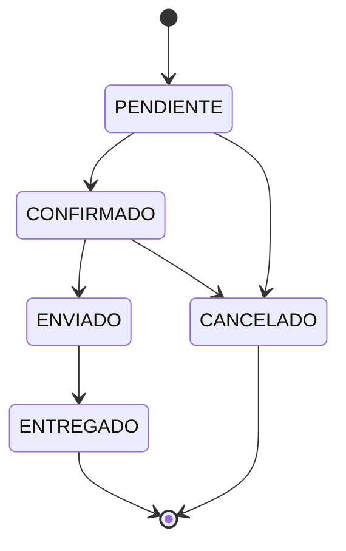

# ShopAPI

**API REST de gestión de pedidos e inventario**, con autenticación JWT, control de stock en tiempo real y una máquina de estados de pedidos con reglas de negocio reales.


No es un CRUD de ejemplo — modela un flujo de negocio completo: un producto tiene stock real, un pedido lo descuenta y lo repone según su estado, y cada usuario ve solo lo que le corresponde según su rol.

## Índice

- [Por qué este proyecto](#por-qué-este-proyecto)
- [Funcionalidades](#funcionalidades)
- [Stack técnico](#stack-técnico)
- [Arquitectura](#arquitectura)
- [Modelo de datos](#modelo-de-datos)
- [Seguridad y roles](#seguridad-y-roles)
- [Máquina de estados de un pedido](#máquina-de-estados-de-un-pedido)
- [Cómo ejecutarlo en local](#cómo-ejecutarlo-en-local)
- [Documentación de la API](#documentación-de-la-api)
- [Testing](#testing)
- [Decisiones técnicas destacadas](#decisiones-técnicas-destacadas)
- [Roadmap](#roadmap)
- [Sobre el autor](#sobre-el-autor)

## Por qué este proyecto

La mayoría de proyectos de portfolio junior se quedan en un CRUD con cuatro endpoints. ShopAPI está pensado para demostrar lo que de verdad se pide en una oferta de backend Java: autenticación y autorización reales (no solo "hay un login"), lógica de negocio con estado (no solo guardar y leer filas), y una base de pruebas que demuestra que ese comportamiento no es casualidad.

## Funcionalidades

- **Autenticación JWT** con registro y login, contraseñas con hash BCrypt
- **Autorización por rol** (`ADMIN`, `VENDEDOR`, `CLIENTE`) a nivel de endpoint
- **Autorización por propiedad de datos**: un `CLIENTE` solo ve y gestiona sus propios pedidos, independientemente de su rol
- **Control de stock real**: un pedido valida disponibilidad y descuenta stock de forma atómica al crearse
- **Máquina de estados de pedidos** con transiciones validadas (`PENDIENTE → CONFIRMADO → ENVIADO → ENTREGADO`, o cancelación con reposición automática de stock)
- **Snapshot de precio**: cada línea de pedido guarda el precio del producto en el momento de la compra, no una referencia viva que cambiaría con el catálogo
- **Paginación** en todos los listados (`Page`/`Pageable` de Spring Data)
- **Manejo de errores centralizado** con respuestas JSON consistentes (400/401/403/404/409) en toda la API
- **Documentación interactiva** con Swagger / OpenAPI
- **Tests unitarios** de la lógica de negocio con Mockito y AssertJ, y **tests de integración** con PostgreSQL real vía Testcontainers

## Stack técnico

| Categoría | Tecnología |
|---|---|
| Lenguaje | Java 24 (LTS) |
| Framework | Spring Boot 4.0.7 / Spring Framework 7 |
| Persistencia | Spring Data JPA + Hibernate, PostgreSQL 16 |
| Seguridad | Spring Security 7, JWT (JJWT), BCrypt |
| Testing | JUnit 5, Mockito, AssertJ, Testcontainers |
| Documentación | springdoc-openapi (Swagger UI) |
| Contenedores | Docker / Docker Compose |
| Build | Maven |

## Arquitectura

Monolito modular organizado **por dominio**, no por capa técnica — cada paquete agrupa todo lo relativo a una entidad (entidad, repositorio, DTOs, mapper, servicio, controlador), en vez de dispersarlo en carpetas `controllers/`, `services/`, `repositories/` compartidas por todo el proyecto:

```
com.shopapi
 ├── producto/    entidad, repositorio, DTOs, mapper, servicio, controlador
 ├── categoria/
 ├── usuario/
 ├── pedido/      incluye LineaPedido y la maquina de estados
 ├── auth/        login y registro
 ├── security/    JWT, filtros, UserDetailsService, manejo de 401/403
 ├── common/      excepciones globales y respuestas de error
 └── config/      OpenAPI y configuración transversal
```

Es una decisión deliberada: se comporta como un monolito modular pensado para poder extraerse a microservicios el día que el proyecto lo necesite, sin la sobreingeniería de montar microservicios reales para un proyecto de este tamaño.

Cada petición atraviesa siempre las mismas capas:

```
Controller → Service → Repository → Base de datos
                ↕
              DTO ↔ Entity (via Mapper)
```

Los DTOs nunca exponen las entidades directamente: desacoplan el contrato de la API del modelo de base de datos y evitan filtrar campos sensibles (la contraseña, por ejemplo, jamás sale en una respuesta).

## Modelo de datos



## Seguridad y roles

La autenticación es *stateless*: cada petición se identifica con un JWT en la cabecera `Authorization: Bearer <token>`, sin sesiones guardadas en el servidor.

| Acción | CLIENTE | VENDEDOR | ADMIN |
|---|:---:|:---:|:---:|
| Ver catálogo (productos/categorías) | ✅ | ✅ | ✅ |
| Crear/editar productos y categorías | ❌ | ✅ | ✅ |
| Eliminar productos/categorías | ❌ | ❌ | ✅ |
| Crear un pedido propio | ✅ | ✅ | ✅ |
| Crear un pedido a nombre de otro usuario | ❌ | ✅ | ✅ |
| Ver pedidos propios | ✅ | ✅ | ✅ |
| Ver pedidos de cualquier usuario | ❌ | ✅ | ✅ |
| Cambiar el estado de un pedido | ❌ | ✅ | ✅ |
| Gestionar usuarios | ❌ | ❌ | ✅ |

## Máquina de estados de un pedido



Cancelar un pedido (desde `PENDIENTE` o `CONFIRMADO`) repone automáticamente el stock de cada línea. `ENTREGADO` y `CANCELADO` son estados finales: cualquier transición no contemplada en el diagrama devuelve `409 Conflict`.

## Cómo ejecutarlo en local

**Requisitos**: JDK 24, Docker Desktop, Maven (o usar el wrapper incluido).

```bash
# 1. Clonar el repositorio
git clone https://github.com/enriquegar95/shopapi.git
cd shopapi

# 2. Levantar PostgreSQL con Docker Compose
docker compose up -d

# 3. Arrancar la aplicación
./mvnw spring-boot:run        # Linux/macOS
mvnw.cmd spring-boot:run      # Windows
```

La API queda disponible en `http://localhost:8080`, y la documentación interactiva en `http://localhost:8080/swagger-ui/index.html`.

**Prueba rápida del flujo completo:**

```bash
# Registrarse (rol CLIENTE por defecto)
curl -X POST http://localhost:8080/api/v1/auth/register \
  -H "Content-Type: application/json" \
  -d '{"nombre":"Prueba","email":"prueba@test.com","password":"contrasena123"}'

# El registro devuelve un token JWT listo para usar en el resto de peticiones
```

## Documentación de la API

Con la aplicación corriendo, Swagger UI (`/swagger-ui/index.html`) documenta todos los endpoints, con la posibilidad de autenticarte con un token JWT desde el propio botón **Authorize** y probar cualquier endpoint protegido directamente desde el navegador.

## Testing

```bash
./mvnw test          # Linux/macOS
mvnw.cmd test         # Windows
```

- **Tests unitarios** de la lógica de negocio (`ProductoService`, `PedidoService`, `JwtService`), con dependencias simuladas vía Mockito — sin tocar base de datos, ejecución en milisegundos.
- **Tests de integración** contra una instancia real de PostgreSQL levantada de forma efímera con Testcontainers, verificando el comportamiento completo incluida la capa de seguridad.

Se prioriza cubrir la lógica con reglas de negocio reales (control de stock, transiciones de estado, autorización por propiedad) por encima de tests triviales de CRUD, que aportan poco valor de verificación.

## Decisiones técnicas destacadas

Algunas decisiones de diseño que fueron deliberadas, no por defecto:

- **Monolito modular en vez de microservicios**: para el alcance de este proyecto, microservicios reales habrían sido sobreingeniería. La organización por dominio deja la puerta abierta a una futura extracción sin pagar ese coste ahora.
- **El stock se descuenta al crear el pedido, no al confirmarlo**: evita que múltiples pedidos simultáneos "vendan" más unidades de las que existen mientras esperan confirmación.
- **El precio se guarda por línea de pedido (snapshot), no se referencia en vivo**: un cambio de precio en el catálogo no debe alterar retroactivamente pedidos ya realizados.
- **JWT sin estado en servidor**: coherente con el principio *stateless* de REST, sin necesidad de infraestructura de sesiones compartida entre instancias.
- **La autorización por rol y la autorización por propiedad de datos viven en capas distintas**: la primera se declara con `@PreAuthorize` (no depende de datos), la segunda se resuelve en el service (depende de a quién pertenece el recurso concreto).
- **BCrypt, no SHA/MD5, para contraseñas**: diseñado deliberadamente para ser lento, con salt automático por contraseña — resistente a fuerza bruta de una forma que un hash rápido no lo es.

## Roadmap

Fases completadas y verificadas: CRUD base, autenticación y autorización, lógica de negocio de pedidos con máquina de estados. En marcha o pendiente:

- [ ] Suite de tests de integración completa (Testcontainers) para el resto de controllers
- [ ] Documentación OpenAPI enriquecida con ejemplos y descripciones de negocio
- [ ] Caché con Redis para el catálogo de productos
- [ ] Procesamiento asíncrono de pedidos con RabbitMQ
- [ ] Docker Compose completo (app + base de datos + servicios) y despliegue
- [ ] CI/CD con GitHub Actions

## Sobre el autor

Desarrollador backend en transición desde soporte IT y gobierno del dato hacia desarrollo Java/Spring, estudiando Ingeniería Informática en la UNED. La experiencia previa en entornos de producción y soporte de incidencias aporta una perspectiva distinta a la de un perfil solo de bootcamp: entender cómo se comporta un sistema en producción, no solo cómo se construye.

- LinkedIn: https://linkedin.com/in/enrique-garcia-ortiz
- GitHub: https://github.com/enriquegar95

## Licencia

MIT
