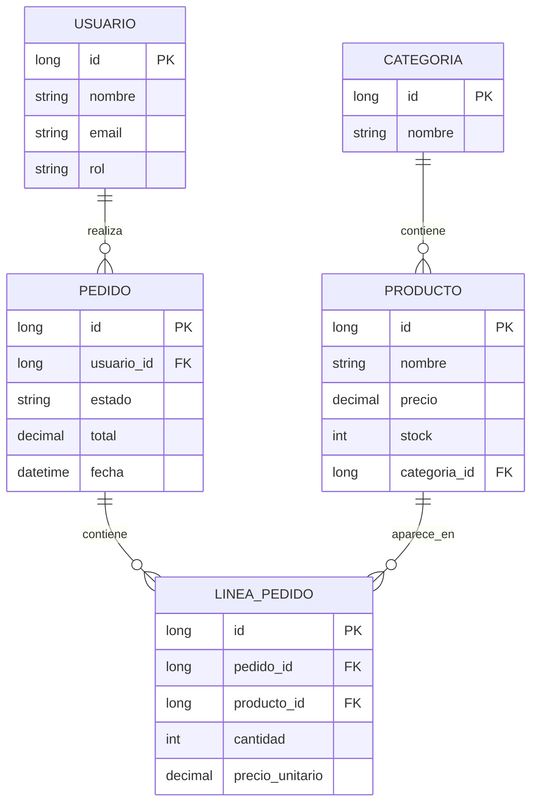
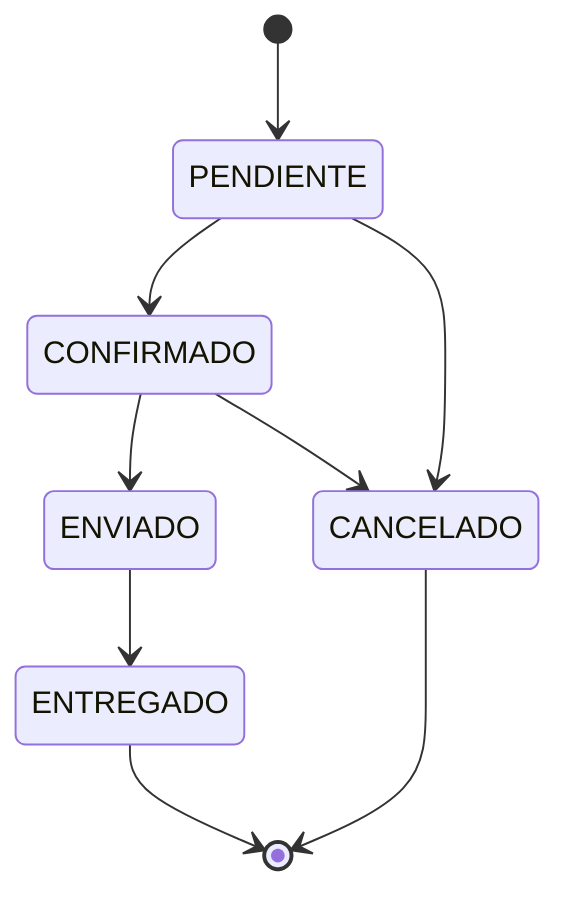

# ShopAPI

**API REST de gestión de pedidos e inventario**, con autenticación JWT, control de stock en tiempo real y una máquina de estados de pedidos con reglas de negocio reales.


[](https://github.com/enriquegar95/shopapi/actions/workflows/ci-cd.yaml)


No es un CRUD de ejemplo — modela un flujo de negocio completo: un producto tiene stock real, un pedido lo descuenta y lo repone según su estado, y cada usuario ve solo lo que le corresponde según su rol.

## Índice

- [Por qué este proyecto](#por-qué-este-proyecto)
- [Funcionalidades](#funcionalidades)
- [Stack técnico](#stack-técnico)
- [Arquitectura](#arquitectura)
- [Modelo de datos](#modelo-de-datos)
- [Seguridad y roles](#seguridad-y-roles)
- [Máquina de estados de un pedido](#máquina-de-estados-de-un-pedido)
- [Cómo ejecutarlo en local](#cómo-ejecutarlo-en-local)
- [Documentación de la API](#documentación-de-la-api)
- [Testing](#testing)
- [CI/CD](#cicd)
- [Decisiones técnicas destacadas](#decisiones-técnicas-destacadas)
- [Roadmap](#roadmap)
- [Sobre el autor](#sobre-el-autor)

## Por qué este proyecto

La mayoría de proyectos de portfolio junior se quedan en un CRUD con cuatro endpoints. ShopAPI está pensado para demostrar lo que de verdad se pide en una oferta de backend Java: autenticación y autorización reales (no solo "hay un login"), lógica de negocio con estado (no solo guardar y leer filas), y una base de pruebas que demuestra que ese comportamiento no es casualidad.

## Funcionalidades

- **Autenticación JWT** con registro y login, contraseñas con hash BCrypt
- **Autorización por rol** (`ADMIN`, `VENDEDOR`, `CLIENTE`) a nivel de endpoint
- **Autorización por propiedad de datos**: un `CLIENTE` solo ve y gestiona sus propios pedidos, independientemente de su rol
- **Control de stock real**: un pedido valida disponibilidad y descuenta stock de forma atómica al crearse
- **Máquina de estados de pedidos** con transiciones validadas (`PENDIENTE → CONFIRMADO → ENVIADO → ENTREGADO`, o cancelación con reposición automática de stock)
- **Snapshot de precio**: cada línea de pedido guarda el precio del producto en el momento de la compra, no una referencia viva que cambiaría con el catálogo
- **Caché con Redis** para consultas de productos individuales, con invalidación correcta cuando el stock cambia desde el servicio de pedidos, no solo desde el propio CRUD de productos
- **Mensajería asíncrona con RabbitMQ**: eventos de creación y cambio de estado de pedidos, publicados únicamente tras confirmar la transacción, con cola muerta (DLQ) para mensajes que no se pueden procesar
- **Paginación** en todos los listados (`Page`/`Pageable` de Spring Data)
- **Manejo de errores centralizado** con respuestas JSON consistentes (400/401/403/404/409) en toda la API
- **Documentación interactiva** con Swagger / OpenAPI, con ejemplos y descripciones de negocio en cada endpoint
- **Stack completamente containerizado**: la aplicación y sus cuatro dependencias (PostgreSQL, Redis, RabbitMQ, pgAdmin) se levantan con un único `docker compose up`
- **CI/CD con GitHub Actions**: cada push ejecuta la suite de tests completa y publica automáticamente la imagen Docker
- **Tests unitarios** de la lógica de negocio con Mockito y AssertJ, y **tests de integración** con PostgreSQL, Redis y RabbitMQ reales vía Testcontainers

## Stack técnico

| Categoría | Tecnología |
|---|---|
| Lenguaje | Java 21 (LTS) |
| Framework | Spring Boot 4.0.7 / Spring Framework 7 |
| Persistencia | Spring Data JPA + Hibernate, PostgreSQL 16 |
| Seguridad | Spring Security 7, JWT (JJWT), BCrypt |
| Caché | Redis 7 |
| Mensajería | RabbitMQ 4 (exchange topic, cola muerta) |
| Testing | JUnit 5, Mockito, AssertJ, Testcontainers, Awaitility |
| Documentación | springdoc-openapi (Swagger UI) |
| Contenedores | Docker / Docker Compose (multi-etapa) |
| CI/CD | GitHub Actions, GitHub Container Registry |
| Build | Maven |

## Arquitectura

Monolito modular organizado **por dominio**, no por capa técnica — cada paquete agrupa todo lo relativo a una entidad (entidad, repositorio, DTOs, mapper, servicio, controlador), en vez de dispersarlo en carpetas `controllers/`, `services/`, `repositories/` compartidas por todo el proyecto:

```
com.shopapi
 ├── producto/    entidad, repositorio, DTOs, mapper, servicio, controlador
 ├── categoria/
 ├── usuario/
 ├── pedido/      incluye LineaPedido y la maquina de estados
 ├── auth/        login y registro
 ├── security/    JWT, filtros, UserDetailsService, manejo de 401/403
 ├── messaging/   eventos de pedido, exchange/colas de RabbitMQ
 ├── common/      excepciones globales y respuestas de error
 └── config/      OpenAPI, Redis y configuración transversal
```

Es una decisión deliberada: se comporta como un monolito modular pensado para poder extraerse a microservicios el día que el proyecto lo necesite, sin la sobreingeniería de montar microservicios reales para un proyecto de este tamaño.

Cada petición atraviesa siempre las mismas capas:

```
Controller → Service → Repository → Base de datos
                ↕
              DTO ↔ Entity (via Mapper)
```

Los DTOs nunca exponen las entidades directamente: desacoplan el contrato de la API del modelo de base de datos y evitan filtrar campos sensibles (la contraseña, por ejemplo, jamás sale en una respuesta).

## Modelo de datos


```mermaid
erDiagram
    USUARIO ||--o{ PEDIDO : realiza
    CATEGORIA ||--o{ PRODUCTO : contiene
    PEDIDO ||--o{ LINEA_PEDIDO : contiene
    PRODUCTO ||--o{ LINEA_PEDIDO : aparece_en

    USUARIO {
        long id PK
        string nombre
        string email
        string rol
    }
    CATEGORIA {
        long id PK
        string nombre
    }
    PRODUCTO {
        long id PK
        string nombre
        decimal precio
        int stock
        long categoria_id FK
    }
    PEDIDO {
        long id PK
        long usuario_id FK
        string estado
        decimal total
        datetime fecha
    }
    LINEA_PEDIDO {
        long id PK
        long pedido_id FK
        long producto_id FK
        int cantidad
        decimal precio_unitario
    }
```

## Seguridad y roles

La autenticación es *stateless*: cada petición se identifica con un JWT en la cabecera `Authorization: Bearer <token>`, sin sesiones guardadas en el servidor.

| Acción | CLIENTE | VENDEDOR | ADMIN |
|---|:---:|:---:|:---:|
| Ver catálogo (productos/categorías) | ✅ | ✅ | ✅ |
| Crear/editar productos y categorías | ❌ | ✅ | ✅ |
| Eliminar productos/categorías | ❌ | ❌ | ✅ |
| Crear un pedido propio | ✅ | ✅ | ✅ |
| Crear un pedido a nombre de otro usuario | ❌ | ✅ | ✅ |
| Ver pedidos propios | ✅ | ✅ | ✅ |
| Ver pedidos de cualquier usuario | ❌ | ✅ | ✅ |
| Cambiar el estado de un pedido | ❌ | ✅ | ✅ |
| Gestionar usuarios | ❌ | ❌ | ✅ |

## Máquina de estados de un pedido


```mermaid
stateDiagram-v2
    [*] --> PENDIENTE
    PENDIENTE --> CONFIRMADO
    PENDIENTE --> CANCELADO
    CONFIRMADO --> ENVIADO
    CONFIRMADO --> CANCELADO
    ENVIADO --> ENTREGADO
    ENTREGADO --> [*]
    CANCELADO --> [*]
```

Cancelar un pedido (desde `PENDIENTE` o `CONFIRMADO`) repone automáticamente el stock de cada línea. `ENTREGADO` y `CANCELADO` son estados finales: cualquier transición no contemplada en el diagrama devuelve `409 Conflict`. Cada creación y cada cambio de estado publica un evento asíncrono (RabbitMQ) para su posterior notificación.

## Cómo ejecutarlo en local

**Requisitos**: Docker Desktop (única dependencia real). Opcionalmente, JDK 21 y Maven si prefieres desarrollar fuera de un contenedor.

### Opción rápida: todo con Docker

```bash
git clone https://github.com/enriquegar95/shopapi.git
cd shopapi
cp .env.example .env   # edita .env con tus propios valores, sobre todo JWT_SECRET
docker compose up --build -d
```

La API queda disponible en `http://localhost:8080`, sin necesidad de tener Java ni Maven instalados. El panel de administración de RabbitMQ está en `http://localhost:15672` (`guest`/`guest`), y pgAdmin en `http://localhost:5050`.

### Opción de desarrollo activo

```bash
docker compose up -d postgres redis rabbitmq   # solo la infraestructura
./mvnw spring-boot:run        # Linux/macOS
mvnw.cmd spring-boot:run      # Windows
```

Documentación interactiva en `http://localhost:8080/swagger-ui/index.html`.

**Prueba rápida del flujo completo:**

```bash
# Registrarse (rol CLIENTE por defecto)
curl -X POST http://localhost:8080/api/v1/auth/register \
  -H "Content-Type: application/json" \
  -d '{"nombre":"Prueba","email":"prueba@test.com","password":"contrasena123"}'

# El registro devuelve un token JWT listo para usar en el resto de peticiones
```

## Documentación de la API

Con la aplicación corriendo, Swagger UI (`/swagger-ui/index.html`) documenta todos los endpoints, con ejemplos realistas en cada campo y la posibilidad de autenticarte con un token JWT desde el propio botón **Authorize** para probar cualquier endpoint protegido directamente desde el navegador. La especificación completa también se exporta a `docs/openapi.yaml`, importable directamente en Postman/Insomnia o visualizable en `editor.swagger.io` sin tener que ejecutar el proyecto.

## Testing

```bash
./mvnw test          # Linux/macOS
mvnw.cmd test         # Windows
```

- **Tests unitarios** de la lógica de negocio (`ProductoService`, `PedidoService`, `JwtService`), con dependencias simuladas vía Mockito — sin tocar infraestructura real, ejecución en milisegundos.
- **Tests de integración** contra instancias reales de PostgreSQL, Redis y RabbitMQ, levantadas de forma efímera con Testcontainers — incluida la verificación de que los eventos de pedido se publican correctamente tras el commit de la transacción (con Awaitility para las aserciones asíncronas).

Se prioriza cubrir la lógica con reglas de negocio reales (control de stock, transiciones de estado, autorización por propiedad, invalidación de caché entre servicios) por encima de tests triviales de CRUD, que aportan poco valor de verificación.

## CI/CD

Cada push a `main` dispara un pipeline en GitHub Actions que compila el proyecto, ejecuta la suite de tests completa (unitarios e integración, Testcontainers incluido) y, si todo pasa, construye y publica la imagen Docker en GitHub Container Registry. Nada se publica sin pasar los tests primero.

## Decisiones técnicas destacadas

Algunas decisiones de diseño que fueron deliberadas, no por defecto:

- **Monolito modular en vez de microservicios**: para el alcance de este proyecto, microservicios reales habrían sido sobreingeniería. La organización por dominio deja la puerta abierta a una futura extracción sin pagar ese coste ahora.
- **El stock se descuenta al crear el pedido, no al confirmarlo**: evita que múltiples pedidos simultáneos "vendan" más unidades de las que existen mientras esperan confirmación.
- **El precio se guarda por línea de pedido (snapshot), no se referencia en vivo**: un cambio de precio en el catálogo no debe alterar retroactivamente pedidos ya realizados.
- **JWT sin estado en servidor**: coherente con el principio *stateless* de REST, sin necesidad de infraestructura de sesiones compartida entre instancias.
- **La autorización por rol y la autorización por propiedad de datos viven en capas distintas**: la primera se declara con `@PreAuthorize` (no depende de datos), la segunda se resuelve en el service (depende de a quién pertenece el recurso concreto).
- **BCrypt, no SHA/MD5, para contraseñas**: diseñado deliberadamente para ser lento, con salt automático por contraseña — resistente a fuerza bruta de una forma que un hash rápido no lo es.
- **La caché de productos se invalida explícitamente desde `PedidoService`, no solo desde `ProductoService`**: el stock cambia al crear o cancelar un pedido, no al editar un producto — invalidar la caché únicamente en el CRUD "obvio" habría dejado datos obsoletos tras cada compra.
- **Los eventos de pedido se publican solo tras el commit de la transacción** (`@TransactionalEventListener(phase = AFTER_COMMIT)`): evita el problema de "escritura dual" entre guardar en base de datos y publicar un mensaje — si la transacción hace rollback, el mensaje nunca llega a salir.
- **Cola muerta (DLQ) para mensajes que fallan al procesarse**: un mensaje que no se puede procesar no se reintenta indefinidamente ni bloquea el resto de la cola — se aísla para revisión, en vez de perderse o atascar el sistema.

## Roadmap

Fases completadas y verificadas: CRUD base, autenticación y autorización, lógica de negocio de pedidos con máquina de estados, documentación OpenAPI, caché con Redis, mensajería con RabbitMQ, containerización completa y CI/CD. Pendiente:

- [ ] Suite de tests de integración completa (Testcontainers) para el resto de controllers (Categoria, Usuario, Pedido)
- [x] Documentación OpenAPI enriquecida con ejemplos y descripciones de negocio
- [x] Caché con Redis para el catálogo de productos
- [x] Mensajería asíncrona con RabbitMQ
- [x] Docker Compose completo (aplicación + PostgreSQL + Redis + RabbitMQ)
- [x] CI/CD con GitHub Actions
- [ ] Despliegue en un entorno accesible públicamente

## Sobre el autor

Desarrollador backend en transición desde soporte IT y gobierno del dato hacia desarrollo Java/Spring, estudiando Ingeniería Informática en la UNED. La experiencia previa en entornos de producción y soporte de incidencias aporta una perspectiva distinta a la de un perfil solo de bootcamp: entender cómo se comporta un sistema en producción, no solo cómo se construye.

- LinkedIn: https://linkedin.com/in/enrique-garcia-ortiz
- GitHub: https://github.com/enriquegar95

## Licencia

MIT
